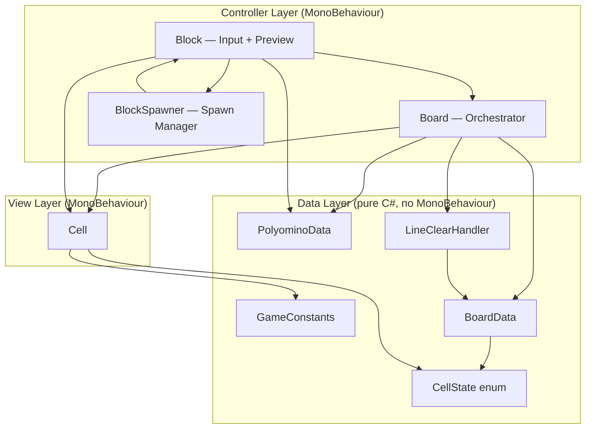

# Walkthrough: Refactor Block Puzzle → SOLID & Clean Architecture

## Tổng quan

Đã refactor toàn bộ 5 file C# từ spaghetti code thành kiến trúc sạch theo nguyên tắc SOLID. **Gameplay không thay đổi** — chỉ cấu trúc code được cải thiện.

## Kiến trúc mới

## Chi tiết thay đổi

### File mới tạo (5 file)

| File | Vai trò | SOLID |
|---|---|---|
| [CellState.cs](file:///e:/Sao%20lưu/word-puzzle-unity/Assets/Scripts/CellState.cs) | Enum thay magic numbers `0, 1, 2` | OCP — dễ thêm state mới |
| [GameConstants.cs](file:///e:/Sao%20lưu/word-puzzle-unity/Assets/Scripts/GameConstants.cs) | Gom tất cả magic numbers | SRP — config tập trung |
| [PolyominoData.cs](file:///e:/Sao%20lưu/word-puzzle-unity/Assets/Scripts/PolyominoData.cs) | Static data, không MonoBehaviour | SRP — data thuần |
| [BoardData.cs](file:///e:/Sao%20lưu/word-puzzle-unity/Assets/Scripts/BoardData.cs) | Logic thuần: state mảng, validation | SRP — tách data khỏi view |
| [LineClearHandler.cs](file:///e:/Sao%20lưu/word-puzzle-unity/Assets/Scripts/LineClearHandler.cs) | Phát hiện + xóa hàng/cột đầy | SRP — tách từ Board |

### File đã sửa (3 file)

| File | Thay đổi chính |
|---|---|
| [Board.cs](file:///e:/Sao%20lưu/word-puzzle-unity/Assets/Scripts/Board.cs) | God class → thin orchestrator. Delegate logic cho `BoardData` và `LineClearHandler` |
| [Cell.cs](file:///e:/Sao%20lưu/word-puzzle-unity/Assets/Scripts/Cell.cs) | Xóa dead code, sửa typo, thêm `UpdateVisual(CellState)` |
| [Block.cs](file:///e:/Sao%20lưu/word-puzzle-unity/Assets/Scripts/Block.cs) | Xóa unused import, dùng `GameConstants`, reference `BlockSpawner` |

### File mới thay thế (1 file)

| File cũ | File mới |
|---|---|
| `Blocks.cs` | [BlockSpawner.cs](file:///e:/Sao%20lưu/word-puzzle-unity/Assets/Scripts/BlockSpawner.cs) |

### File đã xóa (2 file + 2 meta)

- `Polyominos.cs` → thay bằng `PolyominoData.cs`
- `Blocks.cs` → thay bằng `BlockSpawner.cs`

---

## ⚠️ Việc cần làm trong Unity Editor

> [!WARNING]
> Sau khi mở Unity, bạn cần gán lại các SerializeField vì tên class/field đã thay đổi:

### 1. Cell Prefab (`Assets/Prefabs/Cell.prefab`)
Trên component `Cell`:
- `normalSprite` ← gán sprite normal (trước đây là field `normal`)
- `highlightSprite` ← gán sprite highlight (trước đây là field `hightlight`)

### 2. Block Prefab (`Assets/Prefabs/Block.prefab`)
Trên component `Block`:
- `cellPrefab` ← gán Cell prefab
- `board` ← gán Board object
- `spawner` ← gán object có `BlockSpawner` component **(field mới, trước đây là `blocks`)**

### 3. Scene (`Assets/Scenes/Gameplay.unity`)
- Object có `Board` component:
  - `cellPrefab` ← gán Cell prefab (trước: `cellPrefabs`)
  - `cellContainer` ← gán Transform container (trước: `cellTransform`)
- Object có `Blocks` component:
  - **Xóa** component `Blocks` → **Thêm** component `BlockSpawner`
  - `blocks` ← gán mảng Block objects
- Object có `Polyominos` component:
  - **Xóa** component `Polyominos` (không cần nữa — `PolyominoData` là static class)
